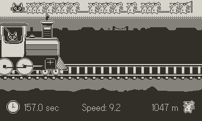

# Kitty Choo Choo

A simple Playdate game made for the 'Making Games' course in ITU. 

  

You are a kitty conducting a train. Your goal is to go fast, but not too fast, otherwise you smash into the evil mice, losing all your speed. You can defeat them with your epic moves in the form of combos, but don't take too long or the timer will get to ya!

### Controls

In menu: 
- Dpad to navigate
- A to select a level

In game:
- Crank clockwise to accelerate
- Crank anticlockwise to brake
- Dpad / A / B to combo

### Setup

A pre-built version playable on the Playdate is available on the [Releases](https://github.com/Danar435/catductor/releases) page.

This repository is following the Playdate template, for information on how to set up the playdate sdk, the coding environment and building the game, [check out their setup instructions](https://github.com/SquidGodDev/playdate-template#setup).
